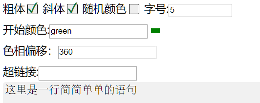
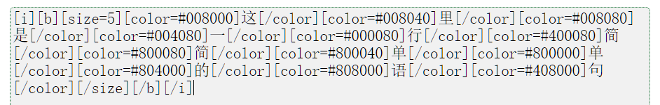

一个BBCode生成器
======
## 简述
  刚接触vue，这是一个简单的使用vue搭建的页面。  
  vue是真的舒服，响应式数据美滋滋，组件爽到飞起。  
  甚至感觉没vue这样一个简单的页面我都写不出来（×  
  由于刚接触vue与js水平限制，代码质量可能极差，望原谅= =  
**动机**：关注的一个[游戏网站的评论区](https://h5mota.com)支持BBcode但不提供预览，想要做一些特效但手写bbcode较为麻烦。因此bbcode实现模式也是按照此网站的要求。 

## [预览地址](https://www.voderl.cn/comment)
______________________
## 组件结构
- input-text ： 输入栏
- input-awesome ： 特效字体输入栏
- input-help ： 输入帮助
- colorZone   ：  特效字体输入栏中颜色框输入颜色，对应颜色图块的显示
- copyButton  ： 主页面的点击复制按钮
- show        ：  真正进行渲染的部分，正则匹配加生成结构

## 使用
#### 设置

#### 预览

#### 生成代码

